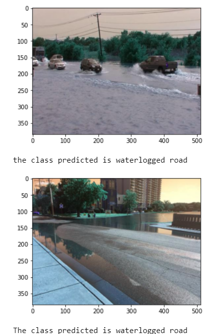
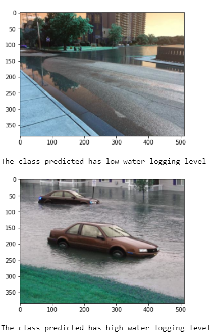

# TECH-A-THON-UrbanWaterlogging

## Tech-A-Thon
ech-A-Thon is a hack-a-thon event organised by Bit Mesra. It is a 5 week long event in which participants have to prepare a machine learning project

## Project Details:
Domain: Machine Learning
Project Name: Urban Water Logging
Theme: Recognition System

## Objective: 
We are aiming to build water smart cities which will identify the real time water logging locations and predict the danger level caused by water logging in these areas.

## Aim:
We plan to investigate machine learning techniques to predict water logged areas in urban streets using input image from street camera. The main goal is given an input street image, we predict if there is water logging in that street or not. In case there is water logging, we also predict a danger level score ranging from 0 to 1. Here 0 stands for less water logging and 1 stands for high level water logging that needs immediate attention.

## Data Description:
1)	For water logging and non-water logging classification-
We use street view water logged images provided by author of the paper called “Detecting water on Roadways from images using Deep Learning”. The non-water-logged dry road images were collected from Google image search. This is used to train our water logging and non-water logging classification model. We have 3 data splits that is train, validation and test.
2)	For danger level classification-
We did not find an existing data set that provides us with such annotations. Hence, we manually label all the images in the above data set, with a score ranging from 0 to 1. This is then used to train a danger level classification model. We have 3 data splits that is train, validation and test.

## Model Description:
1)	Water logging vs non-Water logging classification:
    * We use train input images from data set 1 to train a SVM classifier to predict 0 for non-water logging and 1 for water logging class. We use validation images to choose the hyperparameters for regularization of SVM loss. The model with the best validation score is then selected as the final model.
2) Danger Level Classification
   * We use train input images from data set 2 to train a SVM classifier to predict 0 and 1 for increasing danger levels. We use validation images to choose the hyperparameters for regularization of SVM loss. The model with the best validation score is then selected as the final model.

## Results:
1) Water logging vs non-Water logging classification:
   * We obtained an accuracy of 85.18 on the validation data
   * Some results on test set are as shown below:
   
2) Danger Level Classification
   * We obtained an accuracy of 76.19 on the validation data
   * Some results on test set are as shown below:
   

## Difficulties faced:
Currently we have explored ML techniques for our algorithm. In future we can experiment with deep learning techniques to improve performance. Currently, we don’t have a very large data set for street view water logging images. If a bigger data set is made available in future, then we can train our algorithm on that to obtain better results.
             

